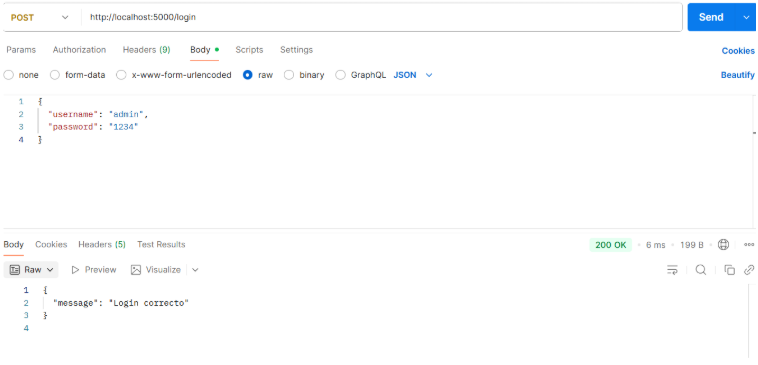

# Login en APIS web con Flask, Nodejs, Laravel, SpringBoot y .NET

**Introducción**  
Para este proyecto el objetivo era crear un login falso en diferentes APIs Web, para ello hemos creado un endpoint llamado `/login`

Este endpoint permite realizar un **login básico.**  
Comprueba si el usuario y la contraseña coinciden con valores fijos definidos en el código 

Recibe un cuerpo JSON con `username` y `password`.  
Si coinciden con los valores esperados, devuelve un mensaje de éxito (`200 OK`). 
 


**Método:** `POST`  
**URL:**`/login`

**Flask**
```Python
USUARIO = "admin"
PASSWORD = "1234"

@app.route('/login', methods=['POST'])
def login():
    data = request.get_json()
    username = data.get("username")
    password = data.get("password")

    if username == USUARIO and password == PASSWORD:
        return jsonify({"message": "Login correcto"}), 200
    else:
        return jsonify({"message": "Credenciales inválidas"}), 401
```
**NodeJS**
```JavaScript
	function auth(req, res, next) {
		const user = basicAuth(req);
		const validUser = user && user.name === 'user' && user.pass === 'password';

		if (!validUser) {
			res.set('WWW-Authenticate', 'Basic realm="API Authentication"');
			return res.status(401).send('Authentication required.');
		}
		next();
	}
```
**Laravel**
https://github.com/IES-Rafael-Alberti/25-26-ciberseguridad-grupo-3/blob/423a886b0231a9f9b4077dffe9bce5f526a52152/Puesta_en_produccion_segura/apis/LaravelAPI/app/Http/Middleware/SimpleAuth.php#L1-L32
**Spring Boot**
```Java
	@PostMapping("/login")
	public String login(@RequestBody Map<String, String> credenciales) {
		if ("username".equals(credenciales.get("usuario")) &&
				"password".equals(credenciales.get("contrasena"))) {
			return "Login correcto";
		}
		return "Credenciales incorrectas";
	}
```
**.NET**  
```csharp
	app.MapPost("/nombres/login", ([FromBody] Dictionary<string, string> credenciales) =>
	{
		if (credenciales.TryGetValue("usuario", out var usuario) &&
			credenciales.TryGetValue("contrasena", out var contrasena) &&
			usuario == "username" && contrasena == "password")
		{
			return Results.Ok("Login correcto");
		}
		return Results.Ok("Credenciales incorrectas");
	});
```


